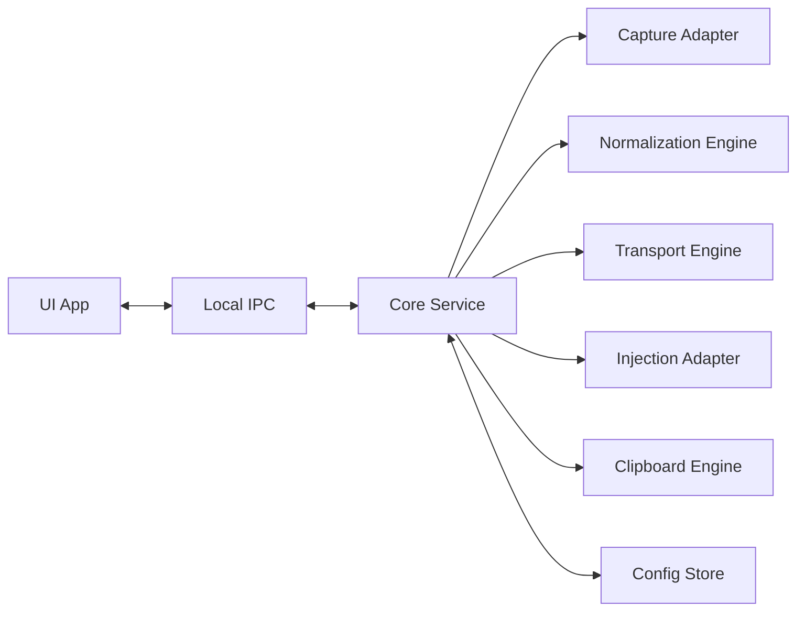

# 桌面端技术设计

## 1. 设计目标

桌面端是产品体验核心。目标是高性能、低延迟、跨平台和稳定可恢复。

关键原则：

- 输入热路径不经过 UI。
- 输入热路径不使用 JSON。
- 输入热路径不访问数据库。
- 输入热路径不等待服务端。
- 鼠标移动允许合并，键盘和点击必须可靠。
- 账户、配置和信令属于控制面，输入转发属于数据面。

## 2. 技术选型

| 模块 | 推荐技术 |
| --- | --- |
| Core Service | Rust |
| 平台 API | Rust FFI + C/C++/Objective-C/Swift glue |
| UI | 原生 UI / Qt / 轻量 Tauri |
| 本地 IPC | Windows named pipe / Unix domain socket / gRPC over local socket |
| 网络 | QUIC，Rust 可选 quinn 或 s2n-quic |
| 并发 | tokio + 专用高优先级线程 |
| 热路径队列 | lock-free ring buffer / crossbeam / rtrb |
| 协议编码 | 自定义 packed binary / FlatBuffers / Cap'n Proto |
| 本地配置 | SQLite / sled / TOML + 原子写入 |
| 安全存储 | macOS / Linux 本地 JSON 文件；Windows Credential Manager |

## 3. 进程架构

建议拆成两个进程：

- Core Service：常驻后台服务，负责输入捕获、输入注入、网络连接、剪贴板、设备状态。
- UI App：配置界面，负责登录、设备管理、布局配置、权限引导和诊断。



## 4. 模块设计

### 4.1 Core Service

职责：

- 管理设备会话。
- 管理连接状态。
- 启动和停止输入捕获。
- 维护目标设备。
- 执行输入归一化。
- 执行网络发送和接收。
- 管理剪贴板同步。
- 处理配置变更。
- 提供本地 IPC API。

启动方式：

- macOS: LaunchAgent，必要能力使用辅助权限。
- Windows: 用户态 companion，安装器清理旧版 Windows Service。
- Linux: systemd user service。

### 4.2 UI App

职责：

- 登录和账户状态。
- 设备列表。
- 设备布局配置。
- 习惯配置。
- 剪贴板配置。
- 权限引导。
- 连接诊断。
- 自动更新。

UI 不参与输入事件处理。

### 4.3 Input Capture Adapter

平台实现：

| 平台 | 捕获方案 |
| --- | --- |
| Windows | Raw Input、Low Level Keyboard/Mouse Hook |
| macOS | CGEventTap、Quartz Event Services |
| Linux X11 | XInput2、evdev |
| Linux Wayland | portal / compositor-specific 能力探测，必要时降级 |

Linux 桌面环境兼容性矩阵：

| 桌面环境 | 显示服务器 | 捕获 | 注入 | 剪贴板 | 备注 |
| --- | --- | --- | --- | --- | --- |
| GNOME | Wayland | 降级：`wayland_global_capture_blocked` | 降级：`wayland_input_injection_blocked` | 降级：`wayland_clipboard_portal_not_wired` | 需要 portal 或 Mutter 专用能力 |
| KDE Plasma | Wayland | 降级：`wayland_global_capture_blocked` | 降级：`wayland_input_injection_blocked` | 降级：`wayland_clipboard_portal_not_wired` | 需要 xdg-desktop-portal 或 KWin 专用能力 |
| wlroots | Wayland | 降级：`wayland_global_capture_blocked` | 降级：`wayland_input_injection_blocked` | 降级：`wayland_clipboard_portal_not_wired` | 不同 compositor 能力差异大 |
| GNOME / KDE / XFCE | X11 | 已支持：`x11_xinput2` | 已支持：`x11_xtest` | 计划：`x11_clipboard_not_wired` | X11 捕获走 XInput2 raw events，注入走 XTest，剪贴板继续补齐 |
| 未知 | 未知 | 降级：`linux_display_server_unknown` | 降级：`linux_display_server_unknown` | 降级：`linux_display_server_unknown` | 依赖环境变量探测 |

捕获事件后进入 ring buffer，不做复杂逻辑。

### 4.4 Input Injection Adapter

平台实现：

| 平台 | 注入方案 |
| --- | --- |
| Windows | SendInput |
| macOS | CGEventPost |
| Linux X11 | XTest、uinput |
| Linux Wayland | portal / compositor-specific API，必要时降级 |

注入层必须处理：

- 按键按下/抬起状态。
- 断线释放所有远端按键。
- Caps Lock 状态差异。
- 鼠标绝对坐标和相对 delta。
- 多显示器坐标转换。

### 4.5 Clipboard Engine

平台实现：

| 平台 | 剪贴板 API |
| --- | --- |
| Windows | Clipboard API |
| macOS | NSPasteboard |
| Linux X11 | X selection |
| Linux Wayland | xdg-desktop-portal clipboard |

MVP 支持纯文本。图片和文件需要分片、类型协商和大小限制。

剪贴板同步必须避免循环：

1. 本地检测剪贴板变化。
2. 生成内容 hash 和版本号。
3. 发送到远端。
4. 远端写入剪贴板并标记来源。
5. 远端监听到自身写入时忽略。

## 5. 操作习惯映射

### 5.1 配置层级

配置分三层：

1. 设备配置：系统类型、键盘布局、鼠标设备、显示器布局。
2. 用户习惯配置：Mac 风格、Windows 风格、Linux 风格、自定义。
3. 连接 Profile：从源设备到目标设备的具体映射规则。

### 5.2 修饰键映射

需要支持：

- Command / Meta。
- Control。
- Option / Alt。
- Windows / Super。
- Shift。
- 左右修饰键分别配置。

典型映射：

| 场景 | 默认映射 |
| --- | --- |
| Mac 控 Windows | Command -> Ctrl，Option -> Alt |
| Windows 控 Mac | Ctrl -> Command，Alt -> Option，Win -> Command |
| Mac 控 Linux | Command -> Ctrl，Option -> Alt |

### 5.3 快捷键语义映射

快捷键映射分两类。

Key Remap：

```text
Command -> Ctrl
Option -> Alt
Control -> Control
```

Action Remap：

```text
Copy -> target_os_copy_shortcut
Paste -> target_os_paste_shortcut
Undo -> target_os_undo_shortcut
Find -> target_os_find_shortcut
SwitchApp -> target_os_app_switch_shortcut
```

MVP 优先实现 Key Remap。Action Remap 可以作为增强能力。

### 5.4 滚轮方向

支持：

- 垂直滚轮反转。
- 水平滚轮反转。
- 自然滚动。
- 鼠标和触控板分开配置。

热路径实现：

```text
out_y = in_y * vertical_multiplier
out_x = in_x * horizontal_multiplier
```

### 5.5 键盘布局

支持两种模式：

- Physical mode：传物理键位，适合开发、游戏和快捷键。
- Text mode：传字符语义，适合跨语言文本输入。

MVP 默认 Physical mode。

## 6. 输入事件流水线


热路径要求：

- 尽量无堆分配。
- 尽量无锁。
- 不做字符串处理。
- 不写同步日志。
- 不访问 UI。
- 不等待网络以外的外部服务。

## 7. 线程模型

建议线程：

- Capture thread：采集本机输入。
- Input transform thread：归一化和路由。
- Transport TX thread：发送输入事件。
- Transport RX thread：接收远端事件。
- Injection thread：注入远端输入。
- Clipboard thread：监听和写入剪贴板。
- Control/session thread：账户、心跳、信令、配置同步。
- UI process：独立进程。

输入相关线程可设置较高优先级。

## 8. 性能指标

目标指标：

| 指标 | 目标 |
| --- | --- |
| LAN 鼠标端到端延迟 | 小于 5ms 到 10ms |
| LAN 键盘端到端延迟 | 小于 10ms |
| 设备切换感知延迟 | 小于 50ms |
| 空闲 CPU | 小于 1% |
| 常驻内存 | 小于 50MB |
| 断线重连 | 小于 1s 到 3s |
| 鼠标热路径分配 | 0 次或接近 0 次 |
| 按键丢失率 | 0 |

## 9. 配置示例

```json
{
  "profile_id": "mac-user-to-windows",
  "source_os": "macos",
  "target_os": "windows",
  "modifier_mapping": {
    "meta_left": "control_left",
    "meta_right": "control_right",
    "option_left": "alt_left",
    "option_right": "alt_right",
    "control_left": "control_left"
  },
  "shortcut_mapping": {
    "cmd+c": "ctrl+c",
    "cmd+v": "ctrl+v",
    "cmd+x": "ctrl+x",
    "cmd+z": "ctrl+z",
    "cmd+a": "ctrl+a",
    "cmd+tab": "alt+tab"
  },
  "scroll": {
    "vertical_multiplier": -1,
    "horizontal_multiplier": -1,
    "natural": true
  },
  "pointer": {
    "speed_multiplier": 1.0,
    "acceleration": "preserve_source"
  },
  "keyboard_mode": "physical"
}
```

## 10. 平台风险

macOS：

- Accessibility 和 Input Monitoring 权限引导必须清晰。
- 某些系统级快捷键可能被本机系统先处理。

Windows：

- UAC 安全桌面和登录界面需要特殊服务能力。
- `Ctrl + Alt + Del` 无法普通注入。

Linux：

- X11 能力较完整。
- Wayland 安全模型导致全局监听和输入注入受限。
- 不同桌面环境行为差异大。

## 11. 测试策略

单元测试：

- 键位映射。
- 快捷键转换。
- 滚轮方向。
- 坐标转换。
- 协议编解码。

集成测试：

- 两台设备连接。
- 网络断开和恢复。
- 剪贴板循环抑制。
- 按键释放保护。

性能测试：

- 高频鼠标移动。
- 高频按键。
- 大剪贴板传输不阻塞输入。
- 长时间空闲资源占用。

兼容测试：

- macOS 多版本。
- Windows 10 / 11。
- Linux X11。
- Linux Wayland 能力探测。
